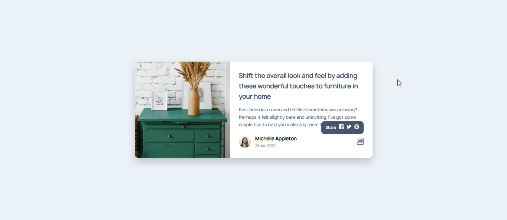

# Frontend Mentor - Article preview component solution

This is a solution to the [Article preview component challenge on Frontend Mentor](https://www.frontendmentor.io/challenges/article-preview-component-dYBN_pYFT). Frontend Mentor challenges help you improve your coding skills by building realistic projects.

## Table of contents

- [Overview](#overview)
  - [The challenge](#the-challenge)
  - [Screenshot](#screenshot)
  - [Links](#links)
- [My process](#my-process)
  - [Built with](#built-with)
  - [What I learned](#what-i-learned)
- [Author](#author)

## Overview

### The challenge

Users should be able to:

- View the optimal layout for the component depending on their device's screen size
- See the social media share links when they click the share icon

### Screenshot



### Links

- Solution URL: [Git Repository](https://github.com/phophobee/article-preview-component)
- Live Site URL: [GitHub Pages](https://phophobee.github.io/article-preview-component/)

## My process

### Built with

- Semantic HTML5 markup
- CSS custom properties
- Flexbox
- CSS Grid
- JavaScript

### What I learned

```html
<body>
  <main class="card">
    <div class="left-box">
      
    </div>
    <div class="right-box">
      <h2>
        Shift the overall look and feel by adding these wonderful touches to
        furniture in your home
      </h2>
      <p>
        Ever been in a room and felt like something was missing? Perhaps it felt
        slightly bare and uninviting. I've got some simple tips to help you make
        any room feel complete.
      </p>
      <div class="footer">
        <div class="author">
          
          <div>
            <strong>Michelle Appleton</strong>
            <small>28 Jun 2020</small>
          </div>
        </div>
        <div class="share-container">
          <button id="shareBtn">
            
          </button>
          <div class="share-popup" id="sharePopup">
            <span>Share</span>
            <a href="#"
              ></a>
            <a href="#"
              ></a>
            <a href="#"
              ></a>
          </div>
        </div>
      </div>
    </div>
  </main>
  <script src="script.js"></script>
</body>
```

```css
@font-face {
  font-family: "Manrope";
  src: url("./fonts/manrope-regular.otf") format("opentype");
}

@font-face {
  font-family: "Manrope Bold";
  src: url("./fonts/manrope-bold.otf") format("opentype");
}

@font-face {
  font-family: "Manrope Medium";
  src: url("./fonts/manrope-medium.otf") format("opentype");
}

* {
  margin: 0;
  padding: 0;
  box-sizing: border-box;
}

body {
  background-color: hsl(210, 46%, 95%);
  font-family: "Manrope";
  display: flex;
  justify-content: center;
  align-items: center;
  height: 100vh;
}

.card {
  display: flex;
  background: white;
  border-radius: 10px;
  box-shadow: 0 15px 30px rgba(0, 0, 0, 0.2);
  overflow: hidden;
  max-width: 800px;
  width: 90%;
}

.left-box {
  width: 40%;
}

.left-box img {
  width: 100%;
  height: 100%;
  object-fit: cover;
  display: block;
}

.right-box {
  width: 60%;
  padding: 30px;
  position: relative;
}

.right-box h2 {
  font-size: 1.3rem;
  color: hsl(217, 19%, 35%);
  margin-bottom: 15px;
}

.right-box p {
  font-size: 0.9rem;
  color: hsl(214, 17%, 51%);
  margin-bottom: 20px;
}

.footer {
  display: flex;
  justify-content: space-between;
  align-items: center;
}

.author {
  display: flex;
  align-items: center;
  gap: 15px;
}

.author img {
  width: 40px;
  border-radius: 50%;
}

.author small {
  color: hsl(212, 23%, 69%);
  display: block;
  margin-top: 2px;
  font-size: 0.75rem;
}

.share-container {
  position: relative;
}

.share-container img {
  border: none;
  width: 20px;
}

.share-popup {
  position: absolute;
  bottom: 40px;
  right: 0;
  background: hsl(217, 19%, 35%);
  color: hsl(210, 46%, 95%);
  padding: 10px 15px;
  border-radius: 10px;
  display: flex;
  align-items: center;
  gap: 10px;
  font-size: 0.75rem;
  visibility: hidden;
  opacity: 0;
  transition: opacity 0.3s ease;
}

.share-popup::after {
  content: "";
  position: absolute;
  bottom: -8px;
  right: 20px;
  border: 8px solid transparent;
  border-top-color: #48556a;
}

.share-popup a img {
  width: 16px;
}

.share-container.active .share-popup {
  visibility: visible;
  opacity: 1;
}

.attribution {
  font-size: 11px;
  text-align: center;
}
.attribution a {
  color: hsl(228, 45%, 44%);
}
```

```js
document.getElementById("shareBtn").addEventListener("click", function () {
  const container = document.querySelector(".share-container");
  container.classList.toggle("active");
});
```

## Author

- Frontend Mentor - [@phophobee](https://www.frontendmentor.io/profile/phophobee)
